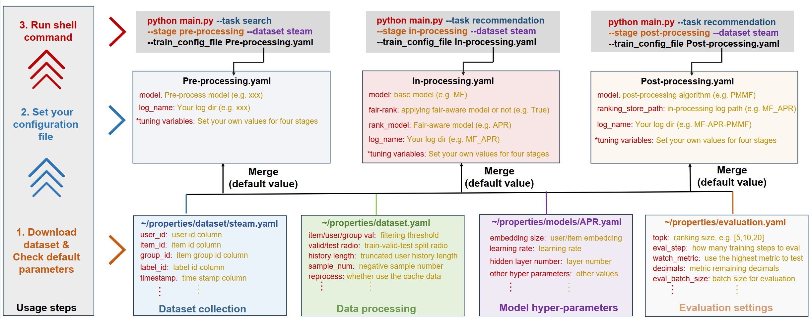
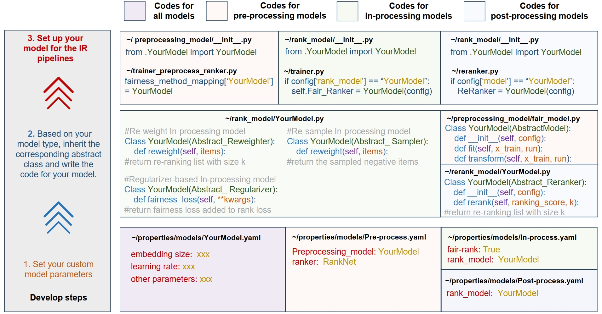

## FairDiverse

[](./LICENSE) | [](https://xuchen0427.github.io/FairDiverse/)

__FairDiverse__ is a toolkit for reproducing and developing fairness- and diversity-aware Information Retrieval (IR) tasks.


## Contact
We welcome the contributors to join our toolkit implementation! Any information, please contact:

[Chen Xu](https://xuchen0427.github.io/): [Email Me](xc_chen@ruc.edu.cn)

[Zhirui Deng](https://scholar.google.com/citations?user=8ZnYg8wAAAAJ&hl=en): [Email Me](zrdeng@ruc.edu.cn)

[Clara Rus](https://scholar.google.com/citations?user=kytW95AAAAAJ&hl=en): [Email Me](c.a.rus@uva.nl)


## General Requirements
```
python>=3.7.0
numpy>=1.20.3
torch>=1.11.0
```

#### For LLMs-based ranking models
Require Linux system
```
backoff==2.2.1
cvxpy==1.6.0
json_repair==0.35.0
networkx==3.1
openai==1.61.1
pandas==1.2.0
PyYAML==6.0
Requests==2.32.3
scikit_learn==1.3.0
scipy==1.15.1
tqdm==4.65.0
transformers==4.32.1
urllib3==1.26.16
vllm>=0.6.0
```
To install vllm, please refer to [vllm official document](https://docs.vllm.ai/en/stable/).

Then, you need to download your llms ([huggingface](https://huggingface.co/models)) to any path 
and write the path into ~/recommendation/properties/LLMs.yaml:

```
llm_path_dict: 
{
      'Llama3-8B': "",
      'Qwen2-7B': "",
      'Mistral-7B': "",
      'ChatGLM-9B': "",
      'bert': "",
      'gpt2': "",
}
```

#### For post-processing method RAIF
Require Gurobi license 
```
mip>=1.15.0
gurobipy>=12.0.1
```

## Quick-start


With the source code,  you can start three steps: 

1. Download the datasets and check the default parameters of the four stages of pipelines (we provide a toy dataset steam already).

2. Set your custom configuration file to execute the pipeline (we already provide a template file).

3. Run the shell command, with the task, stage, dataset, and your custom configuration file specifying (you can directly run the command).

#### Recommendation tasks:
For in-processing methods, please run

```
python main.py --task recommendation --stage in-processing --dataset steam --train_config_file In-processing.yaml
```

Or you can create a new test.py to test:
```
from recommendation.trainer import RecTrainer

config = {model: 'BPR', data_type: 'pair', fair-rank: True, rank_model: 'APR', use_llm: False, log_name: "test"}

trainer = RecTrainer(dataset="steam", train_config=config)
trainer.train()
```

For post-processing methods, please run
```
python main.py --task recommendation --stage post-processing --dataset steam --train_config_file Post-processing.yaml
```


```
from recommendation.reranker import RecReRanker

config = {ranking_store_path: 'steam-base_mf', model: 'CPFair', fair-rank: True, log_name: 'test', fairness_metrics: ["MMF", "GINI"]}

reranker = RecReRanker(dataset="steam", train_config=config)
reranker.rerank()
```

#### Search tasks:

For the post-processing methods, you can begin with:
```
python main.py --task search --stage post-processing --dataset clueweb09 --train_config_file train.yaml
```

## Datasets
For the recommendation dataset, we utilize the dataset format in [Recbole Datasets](https://recbole.io/dataset_list.html).

For the search dataset, we utilize the [ClueWeb dataset](https://lemurproject.org/clueweb09.php/).

## Implemented Models

### Recommendation tasks

#### Base models

| Types    | Models                                                | Descriptions                                                      |
|----------|-------------------------------------------------------|-------------------------------------------------------------------|
| Non-LLMs | [DMF](https://dl.acm.org/doi/10.5555/3172077.3172336) | optimizes the matrix factorization with the deep neural networks. |
| Non-LLMs | [BPR](https://doi.org/10.1145/3543507.3583355)        | optimizes pairwise ranking via implicit feedback.                 |                                                         |
| Non-LLMs | [GRU4Rec](https://arxiv.org/abs/1606.08117)    | employs gated recurrent units (GRUs) for session-based recommendations.                                                           |
| Non-LLMs | [SASRec](https://arxiv.org/abs/1808.09781)     | leverages self-attention mechanisms to model sequential user behavior.                                                           |
| LLMs     | [LLama3](https://arxiv.org/abs/2407.21783)     | utilizing rank-specific prompts to conduct ranking tasks under LLMs                                                           |
| LLMs     | [Qwen2](https://arxiv.org/abs/2309.16609)      | utilizing rank-specific prompts to conduct ranking tasks under LLMs                                                           |


#### In-processing models

| Types    | Models                                                | Descriptions                                                                                                                   |
|----------|-------------------------------------------------------|--------------------------------------------------------------------------------------------------------------------------------|
| Re-weight | [APR](https://ieeexplore.ieee.org/document/10191757) | an adaptive reweighing method that dynamically prioritizes samples near the decision boundary to mitigate distribution shifts. |
| Re-weight | [FairDual](https://github.com/XuChen0427/FairDual)    | applies dual-mirror gradient descent to dynamically compute the weight for each sample to support the worst-off groups.        |
| Re-weight | [IPS](https://dl.acm.org/doi/10.1145/3589334.3648158)               | employs the reciprocal of the sum popularity of items within the group as the weight assigned to that group.                   |
| Re-weight | [Minmax-SGD](https://arxiv.org/abs/1808.09781)        | applies optimizing techniques to dynamically sample groups.                                                                    |
| Re-weight     | [SDRO](https://arxiv.org/abs/2407.21783)              | Improves DRO with the distributional shift to optimize group MMF.                                                              |
| Re-sample     | [FairNeg](https://proceedings.mlr.press/v162/abernethy22a.html)           | adjusts the group-level negative sampling distribution in the training process.                                                |
| Regularizer     | [FOCF](https://dl.acm.org/doi/10.5555/3294996.3295052)           | applies a fair-aware regularization loss of different groups.                                                                  |
| Regularizer     | [Reg](https://pdfs.semanticscholar.org/8706/509307269103496904d595f611f7c189ffab.pdf)           | imposes a penalty on the squared difference between the average scores of two groups across all positive user-item pairs.      |
| Prompt-based     | [FairPrompts](https://aclanthology.org/2024.findings-emnlp.467.pdf)           | Manually designe fair-aware prompts                                                                                            |

#### Post-processing models

| Types    | Models                                                                                | Descriptions                                                                                                                     |
|----------|---------------------------------------------------------------------------------------|----------------------------------------------------------------------------------------------------------------------------------|
| Heuristic | [CP-Fair](https://arxiv.org/abs/2204.08085)                              | applies a greedy solution to optimize the knapsack problem of fair ranking.                                                      |
| Heuristic | [min-regularizer](https://dl.acm.org/doi/fullHtml/10.1145/3543507.3583296)                             | adds an additional fairness score to the ranking scores, capturing the gap between the current utility and the worst-off utility. |
| Heuristic | [RAIF](https://arxiv.org/abs/2501.06362)                                | a model-agnostic repeat-bias-aware item fairness optimization algorithm based on mixed-integer linear programming.               |
| Learning-based | [P-MMF](https://dl.acm.org/doi/fullHtml/10.1145/3543507.3583296)                                             | applies a dual-mirror gradient descent method to optimize the accuracy-fairness trade-off problem. |
| Learning-based     | [FairRec](https://dl.acm.org/doi/10.1145/3366423.3380196)                                           | proposes leveraging Nash equilibrium to guarantee Max-Min Share of item exposure.    |
| Learning-based     | [FairRec+](https://arxiv.org/abs/2201.01180)                      | proposes leveraging Nash equilibrium to guarantee Max-Min Share of item exposure.  |
| Learning-based     | [FairSync](https://arxiv.org/abs/2402.10628)                                | proposes to guarantee the minimum group utility under distributed retrieval stages.          |
| Learning-based     | [Tax-Rank](https://dl.acm.org/doi/10.1145/3626772.3657766) | applies the optimal transportation (OT) algorithm to trade-off fairness-accuracy.    |
| Learning-based     | [Welf](https://arxiv.org/abs/2110.15781)                   | use the Frank-Wolfe algorithm to maximize the Welfare functions of worst-off items.      |


## Develop your own fairness- and diversity- aware models based on our toolkit

You just needs few steps and some lines of codes to develop and evaluate your own models based on our toolkit!

### Recommendation


1. set your custom model parameters
2. based on your model type, inherit the corresponding abstract class and write the code for your model.
3. set up your model for the training pipelines

Then you can run the shell command to evaluate your own models.

#### Examples.
Here, we provide an example code demonstrating how to design a custom in-processing model. The implementation for other base models and post-processing models follows a similar approach.
```
#/recommendation/rank_model/YourModel.py
class YourModel(Abstract_Regularizer):
    def __init__(self, config, group_weight):
        super().__init__(config)

    def fairness_loss(self, input_dict):
        losses = input_dict['scores']
        return torch.var(losses)

#/recommendation/rank_model/__init__.py
from .YourModel import YourModel

#/recommendation/trainer.py
if config["model"] == "YourModel":
  self.Model = YourModel(config)

#test.py
from recommendation.trainer import RecTrainer

config = {model: 'BPR', data_type: 'pair', fair-rank: True, rank_model: 'YourModel', use_llm: False, log_name: "test"}

trainer = RecTrainer(dataset="steam", train_config=config)
trainer.train()
```


## License
FairDiverse uses [MIT License](./LICENSE). All data and code in this project can only be used for academic purposes.
