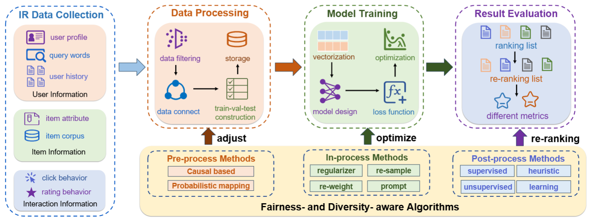

## FairDiverse

[](./LICENSE)

__FairDiverse__ is a toolkit for reproducing and developing fairness- and diversity-aware Information Retrieval (IR) tasks.




## General Requirements
```
python>=3.7.0
numpy>=1.20.3
torch>=1.11.0
```

#### For LLMs-based ranking models
Require Linux system
```
vllm>=0.6.6
```
#### For post-processing method RAIF
Require Gurobi license 
```
mip>=1.15.0
gurobipy>=12.0.1
```

## Quick-start


With the source code,  you can start three steps: 

1. Download the datasets and check the default parameters of the four stages of pipelines (we provide a toy dataset steam already).

2. Set your custom configuration file to execute the pipeline (we already provide a template file).

3. Run the shell command, with the task, stage, dataset, and your custom configuration file specifying (you can directly run the command).

#### Recommendation tasks:
For in-processing methods, please run

```
python main.py --task recommendation --stage in-processing --dataset steam --train_config_file In-processing.yaml
```

For post-processing methods, please run
```
python main.py --task recommendation --stage post-processing --dataset steam --train_config_file Post-processing.yaml
```

#### Search tasks:

For the post-processing methods, you can begin with:
```
python main.py --task search --stage post-processing --dataset clueweb09 --train_config_file train.yaml
```

## Datasets
For the recommendation dataset, we utilize the dataset format in [Recbole Datasets](https://recbole.io/dataset_list.html).

For the search dataset, we utilize the [ClueWeb dataset](http://boston.lti.cs.cmu.edu/Services/clueweb09_batch/).


## License
FairDiverse uses [MIT License](./LICENSE). All data and code in this project can only be used for academic purposes.
